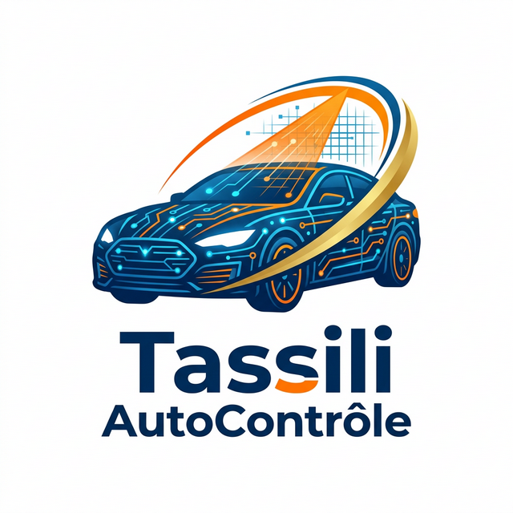

# 🇩🇿 Tassili auto — Système de Contrôle Technique

  

**Tassili auto** (Tassili AutoContrôle) is a premium, high-performance Flutter application designed to revolutionize the vehicle technical inspection booking process in Algeria. Built with a focus on speed, reliability, and user experience, it serves as the #1 smart platform for car owners nationwide.

---

## ✨ Key Features

- **🚀 Instant Booking**: High-speed, parallelized data loading ensures the app is "snappy" and ready in milliseconds.
- **📍 National Coverage**: Access to a network of **14 strategic inspection centers** across Algeria (including Constantine, Setif, Oran, Algiers, and more).
- **🟢 Real-time Status**: Live indicators for "Open" and "Closed" centers with dynamic booking restrictions.
- **💳 Multi-Payment Support**: Integration ready for **CIB, CCP (Algeria Post), and BaridiMob** simulations.
- **🔐 Hybrid Auth System**: Seamlessly handles both Firebase authentication and offline "Demo" modes for maximum accessibility.
- **📱 Premium Glassmorphism UI**: A stunning, modern interface with high-contrast Arabic (Cairo) typography and smooth animations.
- **🏁 Offline-First Logic**: Data fallbacks and smart timeouts ensure the app works beautifully even with poor connectivity.

## 🛠️ Technology Stack

- **Framework**: [Flutter](https://flutter.dev)
- **Database**: [Firebase Cloud Firestore](https://firebase.google.com/docs/firestore)
- **Auth**: [Firebase Auth](https://firebase.google.com/docs/auth)
- **Design System**: Custom Architecture (Glassmorphism + Ultra-Modern Arabic Aesthetics)
- **Fonts**: [Google Fonts (Cairo & Exo 2)](https://fonts.google.com/specimen/Cairo)

## 🎨 Professional Slogan
> **"التطبيق الأول في الجزائر للفحص التقني"**  
> *(The #1 Application in Algeria for Technical Inspection)*

---

## 📸 Branding & Iconography
The app features a custom-designed futuristic logo (shown above and as the app icon) representing the intersection of automotive security and digital innovation. The icon has been specifically optimized and zoomed for maximum clarity on mobile desktops.

---

**Developed with ❤️ for the Algerian Automotive Community.**  
*Powered by Nano Banana Tech aesthetic.*
